# Para que server

- Automatizar todo o processo de atualização do cliente do software da Sualtech
- Prevenir a criação de novo chamados quando um novo cliente é atualizado pela Sualtech

# O que foi feito

Foram criados dois scripts em python: um para o usuário que utiliza o Sualtech e um para atualização interno do repositório no gdrive da informática IB.
- Instalado um script nos computadores que utilizam o Sualtech no lugar do atalho que fica no desktop
- Toda vez que o usuário executa o script do desktop, é checado se existe uma nova versão do ses_cliente.exe no gdrive da informática IB e se for o caso é feito a atualização
- Instalado script na VM windows 7 com o ip final 221.11, no qual cada uma hora checa no gdrive da Sualtech se houve alguma atualização do software Sualtech e se tiver é feito a atualização para gdrive da informática IB

# Requisitos
- Ter instalado a versão do python 3.8.10
- Ter permissão do gdrive da informática IB e da Sualtech
- Ter permissão para ler o servidor da informática IB
 
# Tutorial - Servidor
- abrir o dir `I:\Suporte\## Repositorio\scripts_automacao\SES_updater\ses_server_updater`
- copiar a pasta para uma pasta local
- abrir o terminal na raiz da pasta
- inserir `python -m venv venv`
- se estiver no powershell `./venv/Scripts/Activate.ps1`
- ou estiver no cmd `./venv/Scripts/Activate.bat`
- ou no bash `/venv/Scripts/Activate`
- inserir `pip install -r req.txt` ou `pip install -r req`

- inserir `pyinstaller --onefile ./main.py`
- abrir o dir `/dist` e copiar o arquivo `main.exe`
- transferir o `main.exe`, nesse caso, vou escolher uma pasta na VM
## Tutorial - Servidor - Credenciais
Se não tiver o arquivo de `credencial.json` ou `creds.json`:

- acessar o google console cloud e abrir o projeto `ses-gmail`  
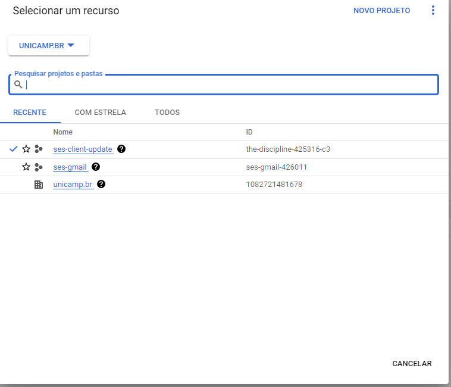
- clicar em `crendenciais`  
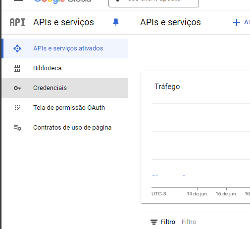
- clicar no botão de download da credencial do computado escolhido  
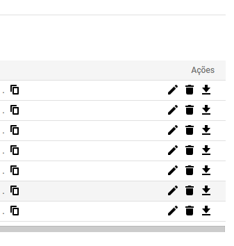
  - se não tiver credencial disponível, clique no `criar credenciais`
    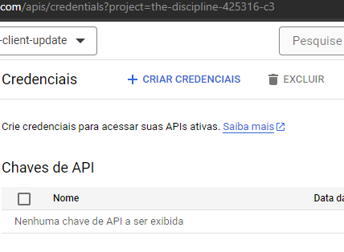
  - clicar em `ID do cliente OAuth`  
  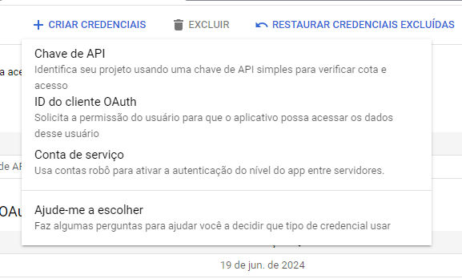
  - clicar em `App para computador` e escolher o nome
  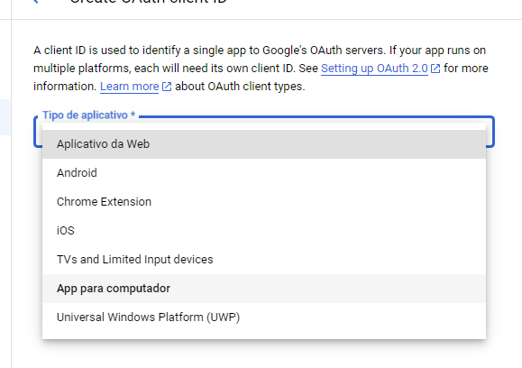
  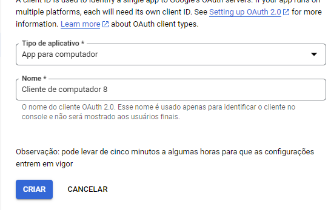
  - clicar em `FAZER DOWNLOAD DO JSON`  
  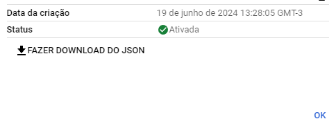
- depois de feito o download da credencial, transferir o .json para a pasta do projeto e renomear como `creds.json`  
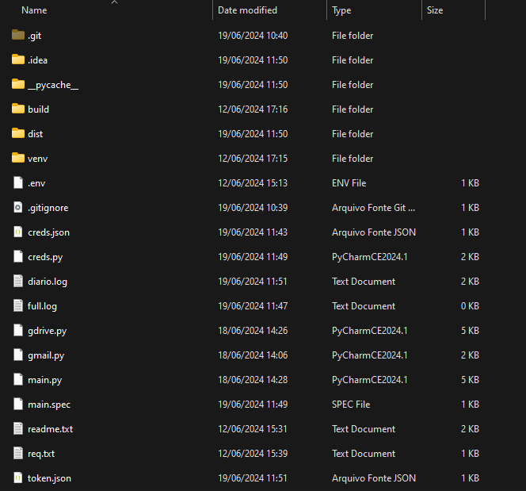  
- executar no terminal `python main.py` na raiz do projeto
  - irá abrir uma janela no navegador e você terá que logar com uma conta da google com o domínio da unicamp com acesso à pasta da informática IB e acesso à pasta da Sualtech. Esse passo é apenas necessário quando o arquivo token.json não foi criado antes
  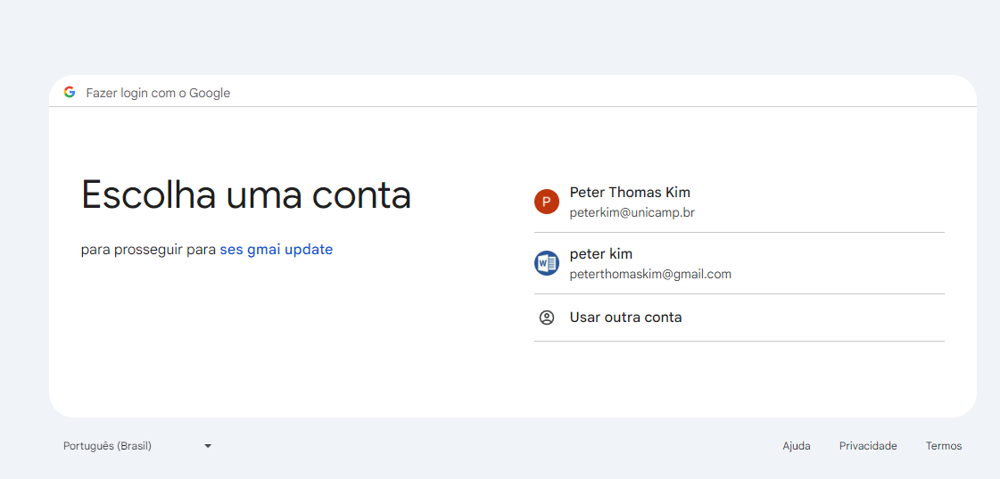
  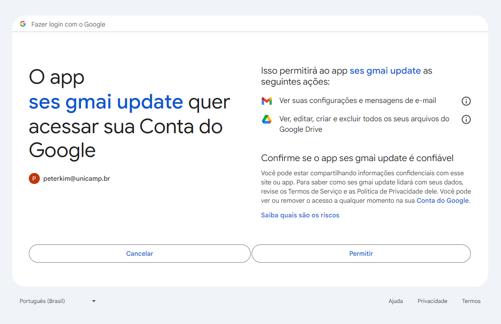
  - o arquivo de `token.json` será criado na pasta do projeto
  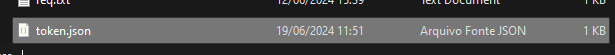
- copiar o arquivo `token.json` para a pasta do projeto
- finalmente executar a executável `main.exe`

# Tutorial - Cliente

- abrir o dir `I:\Suporte\## Repositorio\scripts_automacao\SES_updater\ses_client_gdrive`
- copia a pasta do uma pasta local
- executar no terminal: `python -m venv venv`
- se estiver no powershell `./venv/Scripts/Activate.ps1`
- ou estiver no cmd `./venv/Scripts/Activate.bat`
- ou no bash `/venv/Scripts/Activate`
- inserir `pip install -r req.txt` ou `pip install -r req`
- inserir `pyinstaller --onefile ./main.py`
- abrir o dir `/dist` e copiar o arquivo `main.exe`
- transferir o `main.exe`, nesse caso, no computador do usuário no `c:/usuarios/publico/desktop`, deletar o `ses_client.lnk` atalho do desktop e renomear o executável para `ses_client.exe`
- executar uma vez o `ses_client.exe` e verificar na raiz do `C:/` se a pasta ses client foi criado
  - se a pasta do Sualtech está em um local diferente de `arquivos e programas` ou `programs and files`, manualmente recorte a pasta que está localizado e cole na raiz do `C:/` e renomear para `ses client`  
  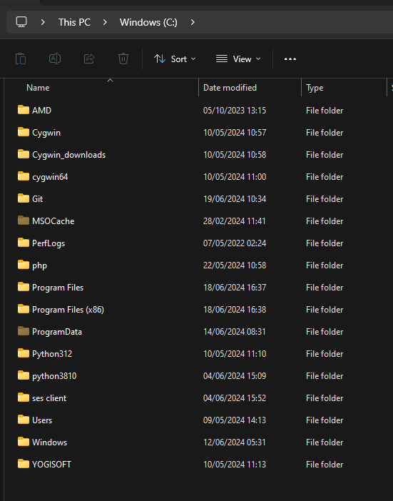
  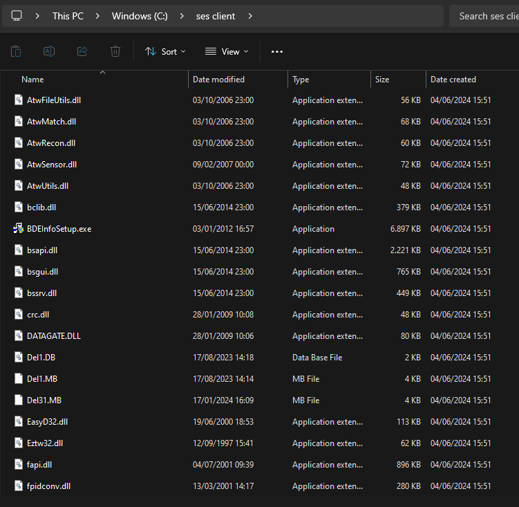
- depois de executado, irá ser criado uma nova pasta dentro da `C:/ses client` chamado de `update_scripts_ib` com um arquivo de `.env`
  - nesse arquivo `.env` está a configuração atual, mas podendo está desatualizado, o link do gdrive da informática IB. Se realmente estiver desatualizado, verificar qual é o link do gdrive atual
- realizar os mesmos passos da etapa **Credenciais**, só se atentando que o nome do projeto é `ses_gmail`
- certificar que o `token.json` e `creds.json` está na pasta `update_scripts_ib`
- por final, executar o executável do desktop e verificar se aparece uma tela preta com logo da sualtech grande
 
# Observações

- Toda vez que o usuário abre o script, precisa esperar até 30 segundos máximos mais ou menos para abrir o software da Sualtech, pois o api do gdrive tem essa limitação intencional imposto
- Se no futuro existir a necessidade de remover essa espera da inicialização, é recomendado trocar o repositório por github ou o gitlab
- Foi feito em uma versão antiga do python por causa da compatibilidade do windows 7 e 8